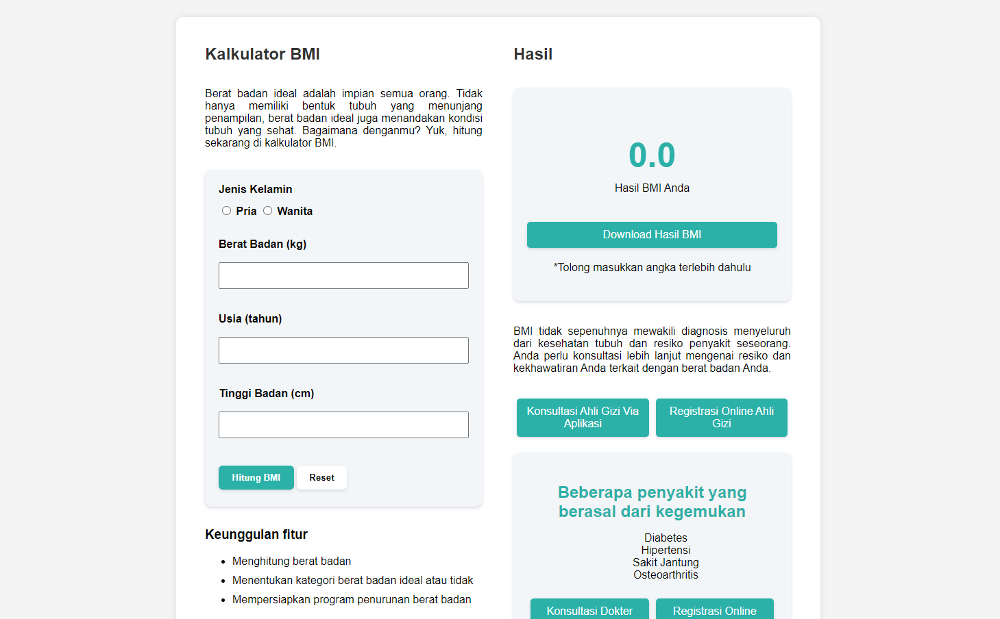

#  BMI Calculator

A simple BMI (Body Mass Index) Calculator web application that allows users to calculate their BMI based on their weight, height, age, and gender. The application provides health recommendations based on the BMI categories. 

**Note: This mini-project is part of an assignment for the RevoU Course program.**

##  Table of Contents

-  [Features](#features)

-  [Technologies Used](#technologies-used)

##  Features

- Calculate BMI by entering weight, height, age, and gender.

- Provides a detailed description of the BMI category:

- Underweight

- Normal weight

- Overweight

- Obesity

##  Technologies Used

-  **HTML5**: Markup language used to structure the web page.

-  **CSS3**: Styling language used to design the layout and appearance.

-  **JavaScript**: Programming language used to calculate BMI and dynamically update the web page.
